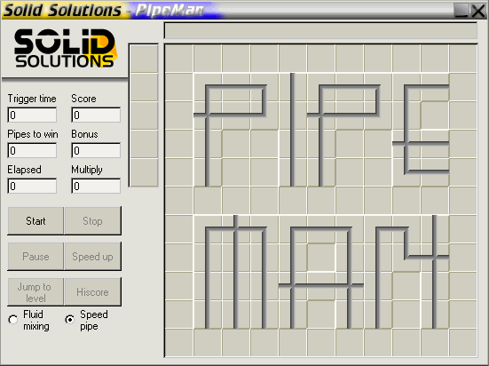



## PipeMan \- New Version \(beta 2\)

### Description

CLASSIC PIPEMAN! This is the great game which is so fun you could die. No graphical bugs or similar. Download and play it. It's fun. Please make maps. Come and vote now!  

But the maps aren't the real ones, they are beta and the "Check pipe" is not implemented but it's coming. The first map is buggy and the start position my disappear, will be fixed when real version is released. The hi-score list has now been added to the game, minor bugs has also been fixed. Also added "text-pipes" for hi-score list and map names.  

Instructions: 

Bonus points are given when passing one-ways, teleporters or point-cross. Also if starting the water before the time triggers. And if doing a loop which means using a cross pipe twice.If speeding up the water all coming bonuses will be doubled. The bonus is added after each map. Too success with a map you have to make the water go thru the amount of pipes shown in the upper left corner. Also if replacing an old pipe there is a small delay.

Now, have fun and don't let the water out of the pipes.  

Beta testing: 

If you all want to have a real good pipe game, I need someone to beta test parts of it for me. No experience needed. And you will of coarse be mentioned below if you sign up as an beta tester.  

Please make some maps for this game: 

Anyone can create maps for this game by mailing me. Please I need your support for this game. If interest is shown I will create a REAL map maker for it.  

Thank you all for your interest in this game, you shouldn't thank me. It's all of you that made this possible. And huge thanks for all those who comment my work.  

Special thanks: 

[NLS] Wolfgang Kienreich - Exciting ideas 

KDC - Appreciated interest
 
### More Info
 

             |
---                |---
**Submitted On**   |2001-09-12 19:12:24
**By**             |[Andreas Svensson](https://github.com/Planet-Source-Code/PSCIndex/blob/master/ByAuthor/andreas-svensson.md)
**Level**          |Intermediate
**User Rating**    |4.5 (50 globes from 11 users)
**Compatibility**  |VB 3\.0, VB 4\.0 \(16\-bit\), VB 4\.0 \(32\-bit\), VB 5\.0, VB 6\.0
**Category**       |[Games](https://github.com/Planet-Source-Code/PSCIndex/blob/master/ByCategory/games__1-38.md)
**World**          |[Visual Basic](https://github.com/Planet-Source-Code/PSCIndex/blob/master/ByWorld/visual-basic.md)
**Archive File**   |[PipeMan \- 263389122001\.zip](https://github.com/Planet-Source-Code/andreas-svensson-pipeman-new-version-beta-2__1-27101/archive/master.zip)

